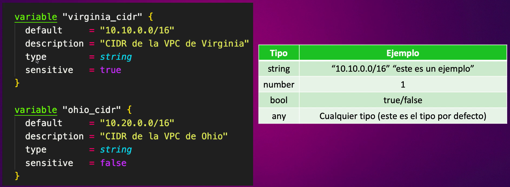
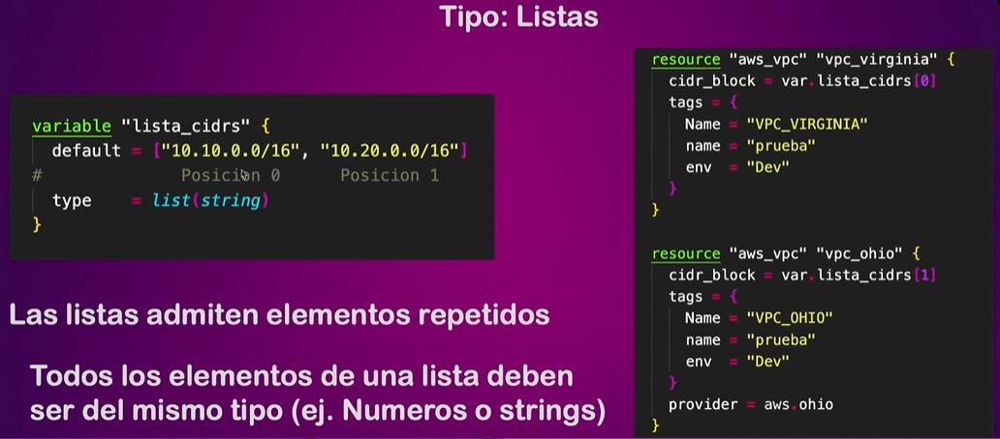
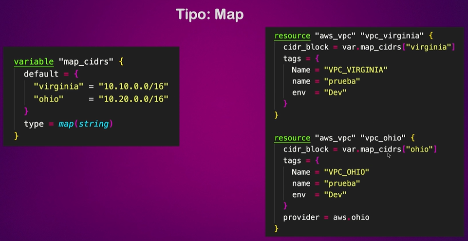
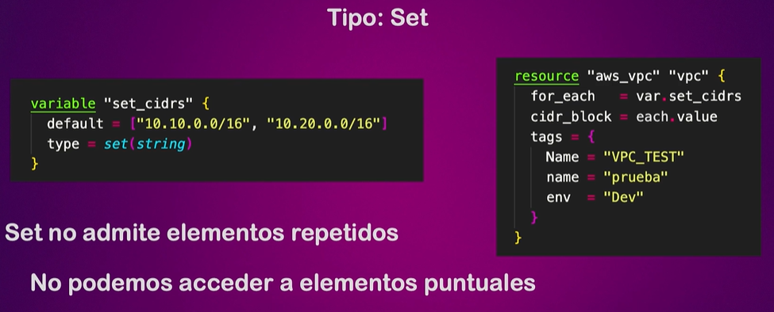
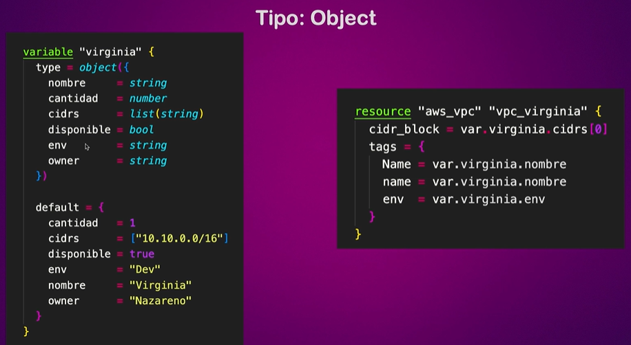
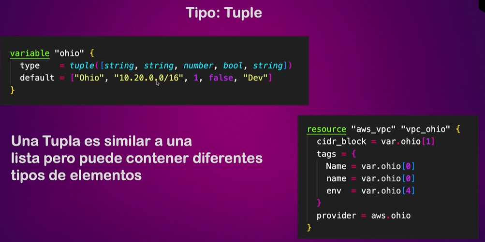
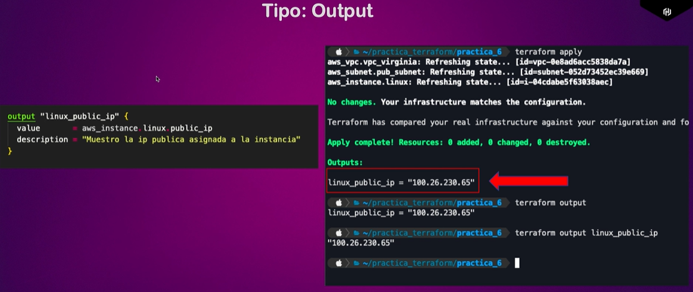
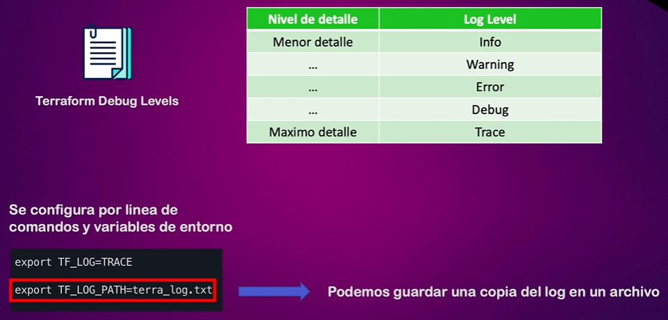

# Apuntes Terraform

## Comandos
### Terraform
- ```terraform init``` - Inicializa los providers del proyecto
- ```terraform init -upgrade``` - Actualiza los providers el proyecto

- ```terraform plan``` - Lista las modificaciones de los recursos.
- ```terraform plan --out filename.plan``` - Almacena el listado de modificaciones de los recursos en un fichero
- ```terraform plan --var var_name='value'``` - Genera el listado de modificaciones de los recursos y asignando el valor a la variable var_name
- ```terraform plan --var-file filename.tfvars``` - Genera el listado de modificaciones de los recursos y usando el fichero filename.tfvars como valor de las variables
- ```terraform plan --target resource``` - Genera el listado de modificaciones del recurso indicado en target

- ```terraform apply``` - Crea los recursos solicitados.
- ```terraform apply filename.plan``` - Crea los recursos a partir de un listado de modificaciones (plan)
- ```terraform apply --auto-approve=true``` - Crea los recursos sin necesidad de aprobarlos.
- ```terraform apply --target resource``` - Crea el recurso indicado en target
- ```terraform apply --replace resource``` - Crea el recurso destruye y crea de nuevo el recurso indicado

- ```terraform destroy``` - Elimina los recursos creados.

- ```terraform show``` - Muestra los recursos creados.
- ```terraform show --json``` - Muestra los recursos creados.

- ```terraform fmt``` - Formatea todos los archivos .tf del directorio
- ```terraform fmt filename.tf``` - Formatea el fichero especificado

- ```terraform validate``` - Valida la sintaxis de los ficheros .tf

- ```terraform output``` - Muestra un listado con todos los outputs definidos.
- ```terraform output output_name``` - Muestra el valor de un output.

- ```terraform providers``` - Muestra los providers y sus restricciones.

- ```terraform refresh``` - Busca cambios en la infraestructura desplegada y lo vuelva en el tfstate.
- ```terraform graph``` - Genera un gráfico los distintos recursos y sus dependencias.

- ```terraform taint resource``` - Marca un recurso para que se destruya y se vuelva a crear en el próximo apply.
- ```terraform untaint resource``` - Marca un recurso para que se destruya y se vuelva a crear en el próximo apply.

- ```terraform import resource``` - Importa un recurso creado en AWS a nuestro proyecto terraform

### Terraform state
- ```terraform state list``` - Lista de recursos desplegados.
- ```terraform state show resource_name``` - Muestra el detalle de un recurso creado.
- ```terraform state mv origin_resource_name destination_resource_name``` - Mueve un recurso a otro (cambia el nombre de un recurso).
- ```terraform state rm resource_name``` - Borra un recurso en el fichero state. No lo borra ni en el .tf ni en el Cloud.

### Terraform workspaces
- ```terraform workspace list``` - Lista los workspaces.
- ```terraform workspace new name``` - Crea un nuevo workspace y se cambia a ese workspace.
- ```terraform workspace select name``` - Se cambia a ese workspace.
- ```terraform workspace delete name``` - Elimina el workspace.
- ```terraform workspace show``` - Muestra el nombre del workspace actual.

## Restricción de versión requerida


## Variables
Se pueden definir variables de la siguiente manera:
```
variable "var_name" {
  default = "default_value"
}
```
También es posible dejar el valor default a vacío:
```
variable "var_name" {}
```
En este caso la CLI busca en las variables de entorno si existe 'TF_VAR_var_name' y en caso negativo, solicita el valor de la variable al ejecutar crear el plan. 

Es posible usar el fichero ```terraform.tfvars``` para definir los valores de las variables.

A continuación se muestra el orden de prioridad en la definición de las variables de menor a mayor:


### Tipos de variables
Existen los siguientes tipos de variables:


Donde:
- Default: Valor por defecto
- Description: Descripción de la variable
- Type: Tipo de la variable (string, number, bool, list(string o number) any)
- Sensitive: Indica si es una variable sensible. 
  - True: No se muestra el valor de la variable al ejecutar el plan.
  - False: Sí se muestra el valor de la variable al ejecutar el plan.

Terraform puede convertir los siguientes tipos
- String a number
- String a bool

También admite los siguientes tipos de agrupadores de variables:
#### List


#### Map


#### Set


#### Object


#### Tupple
Es una lista pero con elementos de tipos diferentes


## Outputs
Variables que no son conocidas hasta que no se hace el apply.


## Tipos de dependencias
- Implicitas: Son aquellas en las que no se indica el orden de creación de los recursos.
- Explicitas: Son aquellas en las que se indica una dependencia a otro recurso. Para ello es necesario incluir el siguiente código:
  ```
  depends_on = [
    resource
  ]
  ```

## Data
El bloque de código data, permite leer un recurso del provider.
```
data "aws_key_pair" "key" {
    key_name ="mykey"
}
```

## Ciclo de vida de un recurso
Por defecto, cuando se modifica la definición de un recurso y se despliega, se destruye dicho recurso y después se crea uno nuevo. Es posible cambiar el comportamiento incluyendo la propiedad lifecycle:
```
lifecycle {

}
```

Donde puede recibir los siguientes valores:
- create_before_destroy: Crea primero el nuevo recurso antes de eliminar el antiguo. 
- ignore_changes: Recibe el listado de propiedades del recurso los cuales si cambian, no es necesario actualizar el recurso.
- prevent_destroy: Previene que el recurso sea modificado.
- replace_triggered_by: Recibe el listado de otros recursos que provocan que se regenere este recurso.

## Provisioner
Nos permite ejecutar un comando durante la creación o la destrucción de un recurso.

Podemos ejecutar el comando en local o en remoto.
```
resource "aws_instance" "public_instance" {
  ami                     = "ami-019a292cfb114a776"
  instance_type           = "t2.micro"
  subnet_id = aws_subnet.public_subnet.id
  key_name = data.aws_key_pair.key.key_name
  vpc_security_group_ids = [aws_security_group.sg_public_instance.id]
  user_data = <<-EOF
    #!/bin/bash
    echo "Este es un mensaje" > ~/mensaje.txt
  EOF

  provisioner "local-exec" {
    command = "echo instancia creada con IP ${aws_instance.public_instance.public_ip} >> datos.txt"
  }

  provisioner "local-exec" {
    when = destroy
    command = "echo instancia ${self.public_ip} eliminada >> datos.txt"
  }

  provisioner "remote-exec" {
    inline = [ 
      "echo 'hola mundo' > ~/saludo.txt"
    ]
    connection {
      type = "ssh"
      host = self.public_ip
      user = "ec2-user"
      private_key = file("mykey.ppk")
    }
  }
}
```

## Logs
Podemos habilitar los logs en Terraform seteando las siguientes variables:



## Import
Es posible importar un recurso ya creado en AWS con el comando terraform import resource. 
Para ello, tenemos que seguir los siguientes pasos:

1. Creamos un resource vacío:
```
resource "aws_instancce" "example" {}
```

2. Ejecutamos el comando import
```
terraform import aws_instance.example id_instancia
```

3. Completamos la definición de terraform con el contenido del tfstate.
```
resource "aws_instancce" "example" {
  ami                     = var.ec2_specs.ami
  instance_type           = var.ec2_specs.instance_type
  subnet_id = aws_subnet.public_subnet.id
  key_name = data.aws_key_pair.key.key_name
  vpc_security_group_ids = [aws_security_group.sg_public_instance.id]
}
```

## Loops
### Count
```
variable "instances_name" {
  description = "Nombre de las instcancias"
  type        = list(string)
  default     = ["apache", "mysql", "nginx"]
}

resource "aws_instance" "public_instance" {
  count                  = length(var.instances_name)
  ami                    = var.ec2_specs.ami
  instance_type          = var.ec2_specs.instance_type
  subnet_id              = aws_subnet.public_subnet.id
  key_name               = data.aws_key_pair.key.key_name
  vpc_security_group_ids = [aws_security_group.sg_public_instance.id]
  user_data              = file("scripts/userdata.sh")
  tags = {
    Name = var.instances_name[count.index]
  }
}
```
### For each
```
variable "instances_name" {
  description = "Nombre de las instcancias"
  type        = list(string)
  default     = ["apache", "mysql", "nginx"]
}

resource "aws_instance" "public_instance" {
  for_each               = var.instances_name
  ami                    = var.ec2_specs.ami
  instance_type          = var.ec2_specs.instance_type
  subnet_id              = aws_subnet.public_subnet.id
  key_name               = data.aws_key_pair.key.key_name
  vpc_security_group_ids = [aws_security_group.sg_public_instance.id]
  user_data              = file("scripts/userdata.sh")
  tags = {
    Name = each.value
  }
}
```

## Funciones en Terraform
- ```file("path")``` -> Devuelve el contenido del fichero.
- ```toset(var.list)``` -> Transforma una lista a un set.
- ```length(var.list)``` -> Cuenta el numero de elementos de la lista.
- ```max(var.numberList)``` -> Devuelve el mayor numero.
- ```min(var.numberList)``` -> Devuelve el menor numero.
- ```ceil(var.number)``` -> Redondea el numero al entero siguiente.
- ```floor(var.number)``` -> Redondea el numero al entero anterior.
#### Funciones con strings
- ```split(separator, string)``` -> Parte la cadena por el separador (devuelve una lista).
- ```lower(string)``` -> Transforma a minúsculas.
- ```upper(string)``` -> Transforma a mayúsculas.
- ```title(string)``` -> Transforma la primera letra a mayúsculas.
- ```substring(string, start, numero_caracteres)``` -> Obtiene un substring
#### Funciones con lists
- ```join(conector, list)``` -> Une palabras de una lista.
- ```ìndex(lista, string_palabra)``` - > Nos devuelve la posición de la lista donde se encuentra esa palabra.
- ```element(lista, index)``` - > Nos devuelve el elemento de la lista que se encuentra en ese índice.
- ```contains(lista, palabra)``` - > Nos indica si la lista contiene esa palabara
### Funciones con mapas
- ```keys(mapa)``` -> Devuelve un listado con las claves del mapa.
- ```values(mapa)``` -> Devuelve un listado con todos los valores del mapa.
- ```lookup(mapa, key)``` -> Devuelve el valor para esa clave.
- ```lookup(mapa, key, defult)``` -> Devuelve el valor para esa clave. Si no encuentra ese valor, devuelve el default.


## Ejemplos
- Ejemplo 1: Uso de local_file
- Ejemplo 2: Uso de local_file y random_string
- Ejemplo 3: Uso de aws_s3_bucket y random_string
- Ejemplo 4: Uso de constrains y aws_vpc
- Ejemplo 5: Uso de variables

