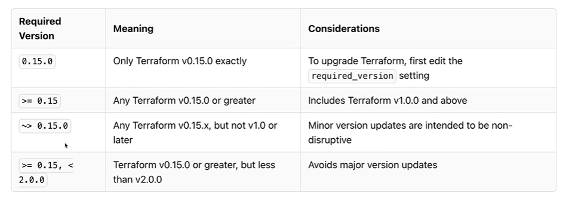
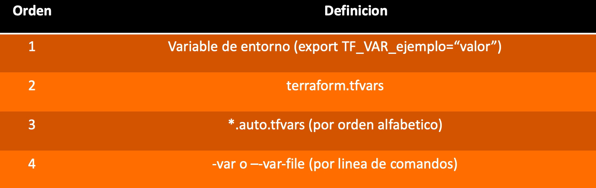

# Apuntes Terraform

## Comandos
- ```terraform init``` - Inicializa los providers del proyecto
- ```terraform init -upgrade``` - Actualiza los providers el proyecto
- ```terraform plan``` - Lista las modificaciones de los recursos.
- ```terraform plan -out filename.plan``` - Almacena el listado de modificaciones de los recursos en un fichero
- ```terraform plan -var var_name='value'``` - Genera el listado de modificaciones de los recursos y asignando el valor a la variable var_name
- ```terraform plan -var-file filename.tfvars``` - Genera el listado de modificaciones de los recursos y usando el fichero filename.tfvars como valor de las variables
- ```terraform apply``` - Crea los recursos solicitados.
- ```terraform apply filename.plan``` - Crea los recursos a partir de un listado de modificaciones (plan)
- ```terraform destroy``` - Elimina los recursos creados.
- ```terraform show``` - Muestra los recursos creados.
- ```terraform fmt``` - Formatea todos los archivos .tf del directorio
- ```terraform fmt filename.tf``` - Formatea el fichero especificado
- ```terraform validate``` - Valida los ficheros .tf

## Restricción de versión requerida


## Variables
Se pueden definir variables de la siguiente manera:
```
variable "var_name" {
  default = "default_value"
}
```
También es posible dejar el valor default a vacío:
```
variable "var_name" {}
```
En este caso la CLI busca en las variables de entorno si existe 'TF_VAR_var_name' y en caso negativo, solicita el valor de la variable al ejecutar crear el plan. 

Es posible usar el fichero ```terraform.tfvars``` para definir los valores de las variables.

A continuación se muestra el orden de prioridad en la definición de las variables de menor a mayor:



## Ejemplos
- Ejemplo 1: Uso de local_file
- Ejemplo 2: Uso de local_file y random_string
- Ejemplo 3: Uso de aws_s3_bucket y random_string
- Ejemplo 4: Uso de constrains y aws_vpc

